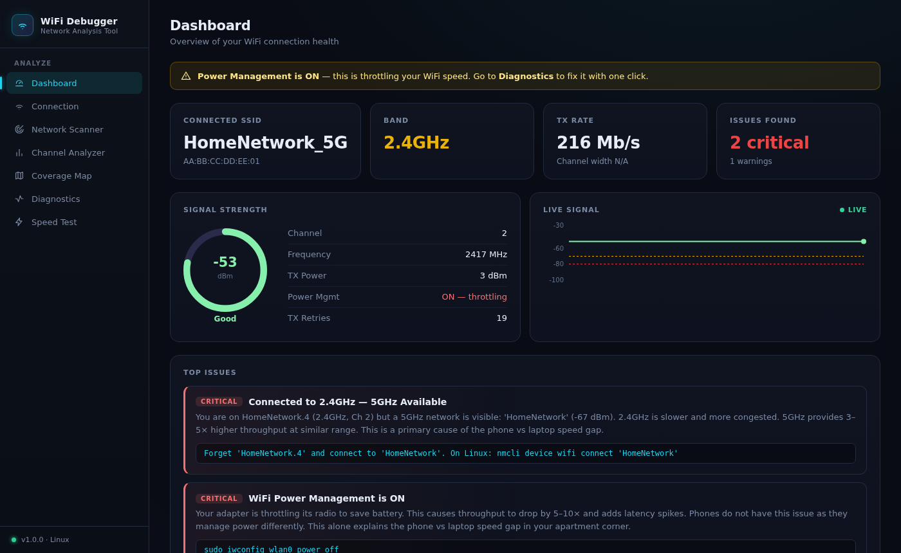
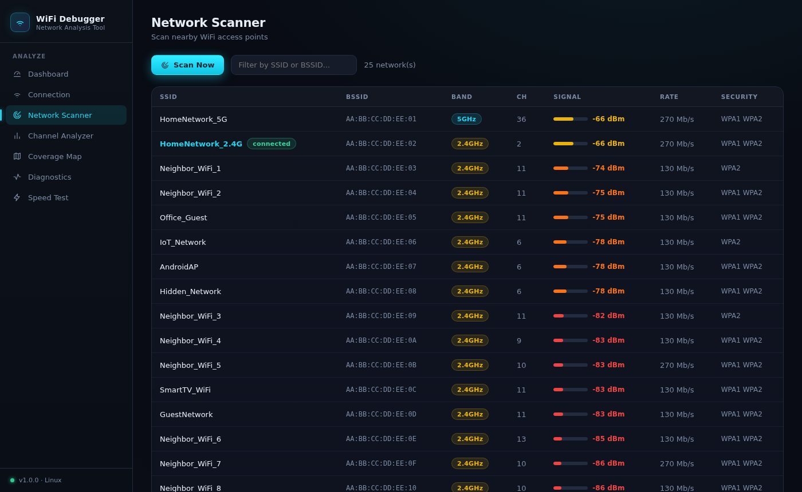
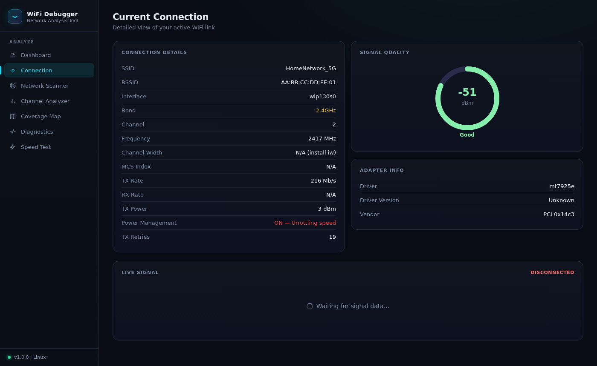
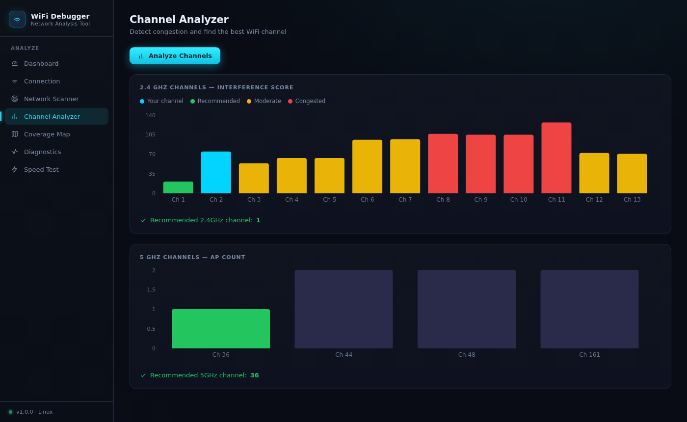
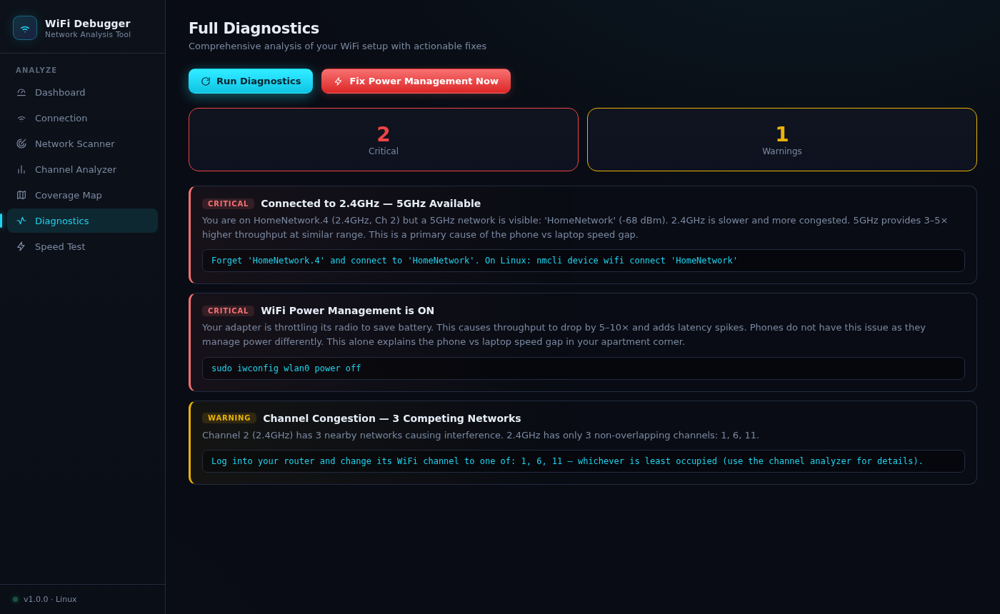
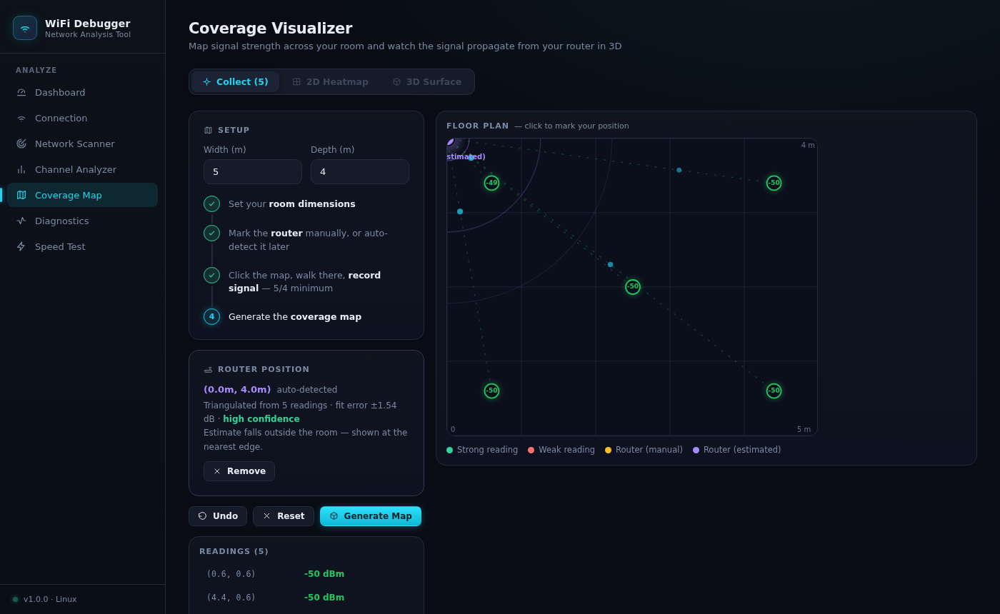
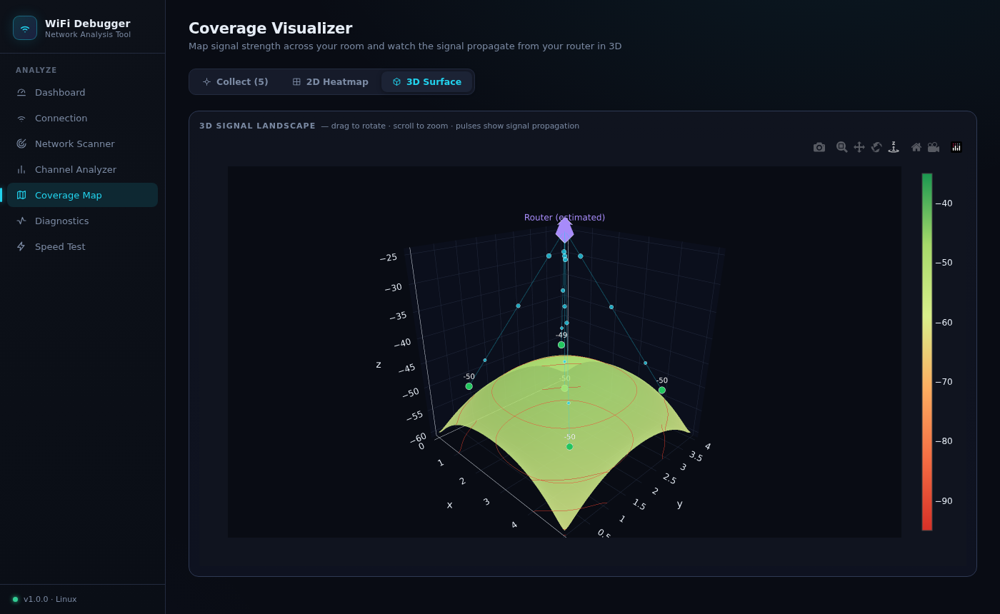
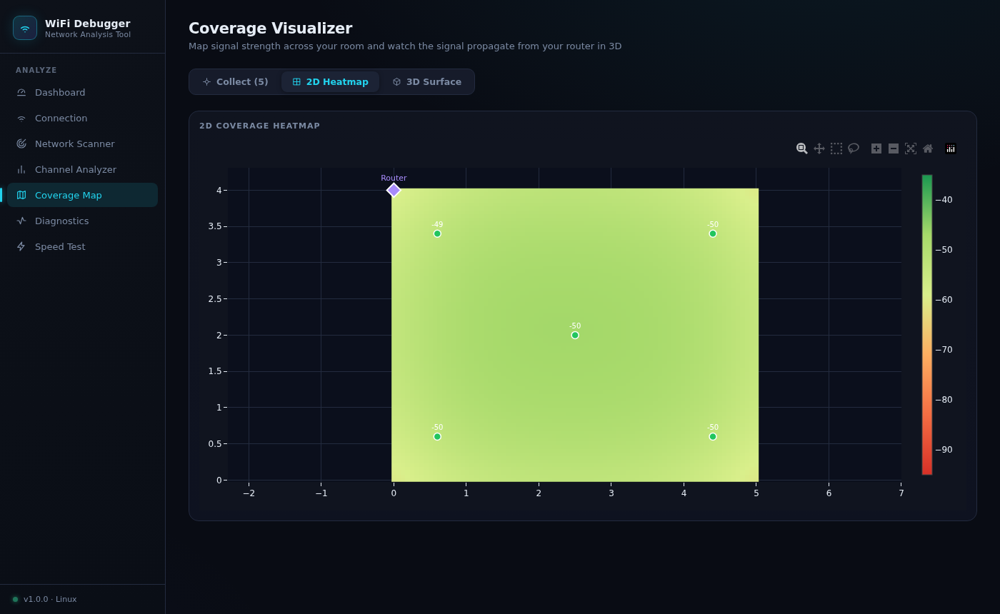
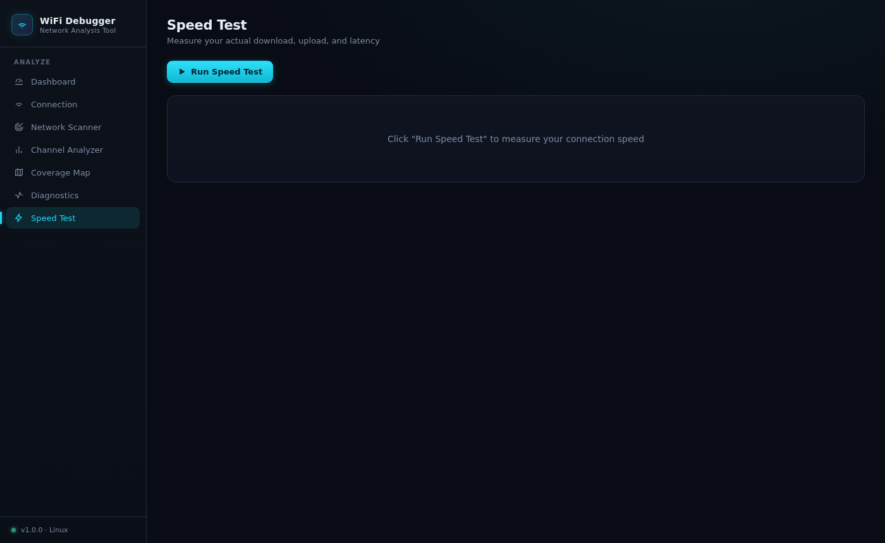

# WiFi Debugger

A cross-platform WiFi analyzer and debugger with a full-stack web UI. Diagnoses connection problems, maps signal coverage across a room, analyzes channel congestion, and identifies adapter issues — all in one tool.

Built to solve a real problem: a laptop getting 4 Mb/s in a corner where a phone gets 40 Mb/s. Two root causes found in minutes: Power Management throttling the adapter, and the laptop stuck on 2.4 GHz while 5 GHz was available next door.

---

## Features

| Module | What it does |
|---|---|
| **Dashboard** | Live signal gauge, WebSocket-streamed chart, top issues at a glance |
| **Connection** | Full link details — band, channel, TX rate, power management, retries, driver |
| **Network Scanner** | All nearby APs with signal bars, band badges, security, rate |
| **Channel Analyzer** | 2.4 GHz interference scores + 5 GHz occupancy with channel recommendations |
| **Coverage Visualizer** | Walk your room, record signal readings, generate an interactive 3D signal landscape with animated rays from your router |
| **Diagnostics** | Rule engine with 8 checks — prioritized findings with copy-paste fix commands |
| **Speed Test** | Built-in HTTP download / upload / latency test, no external CLI required |

Works on **Linux** and **Windows**.

---

## Screenshots

### Dashboard

Real-time signal gauge, live streaming chart via WebSocket, critical issue summary, and a one-click Power Management fix path.



---

### Network Scanner

Full scan of nearby access points — band, channel, signal strength bar, max rate, and security. Your connected network is highlighted.



---

### Connection Details

Complete view of your active WiFi link: band, frequency, channel width, TX/RX rates, TX power, driver, and the power management state that causes the most speed problems.



---

### Channel Analyzer

2.4 GHz interference scores per channel (the three non-overlapping channels 1/6/11 are clearly marked), plus 5 GHz occupancy. Recommends the least congested channel.



---

### Diagnostics

Eight prioritized checks run in sequence. Each finding includes the severity, a plain-English explanation, and a ready-to-run fix command. The "Fix Power Management Now" button applies the fix with one click from the UI.



---

### Coverage Visualizer — Collecting Readings

Click the floor plan, walk there, hit Record. The animated canvas shows radar rings pulsing from the router and cyan pulses traveling along each signal ray in real time. The router position can be placed manually or auto-detected by fitting a path-loss model to your readings (requires 4+ points, works best with 8+).



---

### Coverage Visualizer — 3D Signal Landscape

Interactive 3D surface where signal strength is the Z axis — tall peaks = strong signal, valleys = dead zones. The router floats above the surface as a labeled marker; animated pulses travel from it down to each measurement point along the signal rays. Drag to rotate, scroll to zoom, hover for exact values.



---

### Coverage Visualizer — 2D Heatmap

Top-down floor plan view of the same data. Red = poor signal, green = strong. Measurement points overlaid with their dBm readings. Router pinned as a diamond.



---

### Speed Test

Built-in HTTP speed test — no speedtest-cli required. Measures download from a CDN file, upload to an echo endpoint, and latency/jitter via ICMP ping.



---

## Architecture

```
Network_Tester/
├── wifi_analyzer/           Python package (backend + CLI)
│   ├── platform_layer/      Linux (nmcli, iwconfig, /proc/net/wireless) +
│   │   ├── linux_backend.py   Windows (netsh wlan) backends
│   │   └── windows_backend.py
│   ├── modules/             Feature modules
│   │   ├── diagnostics.py   Rule engine (8 checks)
│   │   ├── coverage.py      Terminal heatmap (matplotlib)
│   │   ├── signal_monitor.py Braille waveform live display
│   │   ├── speed_test.py    HTTP speed test
│   │   └── channel_analyzer.py
│   ├── api.py               FastAPI backend (port 7070)
│   │                          REST + WebSocket /ws/signal
│   └── main.py              CLI entry point (argparse + interactive menu)
└── wifi_ui/                 React + Vite frontend (port 5173)
    └── src/
        ├── pages/           Dashboard, Scanner, Connection, Channels,
        │                      Coverage, Diagnostics, SpeedTest
        └── components/      SignalGauge (SVG), LiveSignalChart (Recharts),
                               Icons (stroke SVGs)
```

### AP Auto-Detection

The router triangulation uses a **log-distance path-loss model**:

```
RSSI(d) = A − 10·n·log₁₀(d)
```

Fit with bounded least-squares (`scipy.optimize.least_squares`) over all recorded readings. Unknowns: AP coordinates `(ax, ay)`, reference power `A` (RSSI at 1 m), path-loss exponent `n`. Solved from six starting positions to escape local minima. Returns position, fit RMSE, confidence level, and whether the estimate falls inside or outside the room boundary.

### Signal Coverage Interpolation

Sparse readings are interpolated onto an 80×80 grid using **Radial Basis Function interpolation** (`scipy.interpolate.Rbf`, `function="multiquadric"`) then smoothed with a Gaussian filter (`sigma=2`).

---

## Quick Start

### Prerequisites

```bash
# Python dependencies (all pre-installed on most Linux systems)
pip install fastapi uvicorn numpy scipy

# Node (for the web UI)
node --version   # 18+ required

# Linux: ensure nmcli and iwconfig are available
which nmcli iwconfig
```

### Terminal-only mode

```bash
cd Network_Tester

# Interactive menu
python3 -m wifi_analyzer

# One-shot flags
python3 -m wifi_analyzer --scan          # scan and print table
python3 -m wifi_analyzer --diagnose      # full diagnostic report
python3 -m wifi_analyzer --monitor 60    # 60-second live signal graph
python3 -m wifi_analyzer --interface wlan1  # specify interface
```

### Web UI mode

```bash
# Terminal 1 — API backend
python3 -m wifi_analyzer --ui
# Listening at http://localhost:7070

# Terminal 2 — React frontend
cd wifi_ui
npm install
npm run dev
# Open http://localhost:5173
```

---

## Diagnostic Checks

| # | Check | Trigger | Severity |
|---|---|---|---|
| 1 | Band selection | On 2.4 GHz while 5 GHz SSID is visible | Critical |
| 2 | Power Management | Adapter PM is ON | Critical |
| 3 | Signal strength | < −75 dBm | Critical / Warning |
| 4 | Channel congestion | 3+ APs on overlapping 2.4 GHz channels | Warning |
| 5 | TX retries | High retry count (RF noise / range) | Warning |
| 6 | Channel width | On 20 MHz while 80 MHz channels are available | Warning |
| 7 | Same SSID on both bands | Router uses same name for 2.4 + 5 GHz | Info |
| 8 | Driver age | Old kernel driver version | Info |

Each finding includes a copy-pasteable fix command, e.g.:

```bash
# Fix Power Management immediately (survives until reboot)
sudo iwconfig wlp130s0 power off

# Connect to 5 GHz
nmcli device wifi connect 'MyNetwork_5G'
```

---

## Linux Data Sources

| Data | Source |
|---|---|
| AP scan | `nmcli --mode tabular --terse device wifi list --rescan yes` |
| Connection info | `iwconfig <iface>` + `nmcli device show` |
| Live signal (fast poll) | `/proc/net/wireless` — direct file read, no subprocess |
| Driver | `readlink /sys/class/net/<iface>/device/driver` |
| Power Management state | Regex on `iwconfig` output: `Power Management:(\w+)` |

---

## Windows Data Sources

| Data | Source |
|---|---|
| AP scan | `netsh wlan show networks mode=bssid` |
| Connection info | `netsh wlan show interfaces` |
| Adapter capabilities | `netsh wlan show drivers` |
| Power Management | `powercfg -change -wireless-adapter-setting-index 0` |
